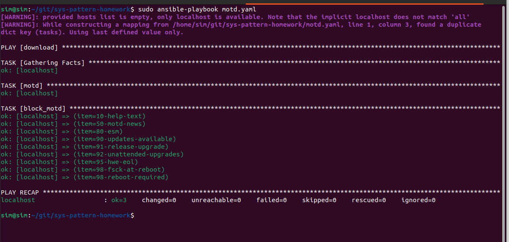
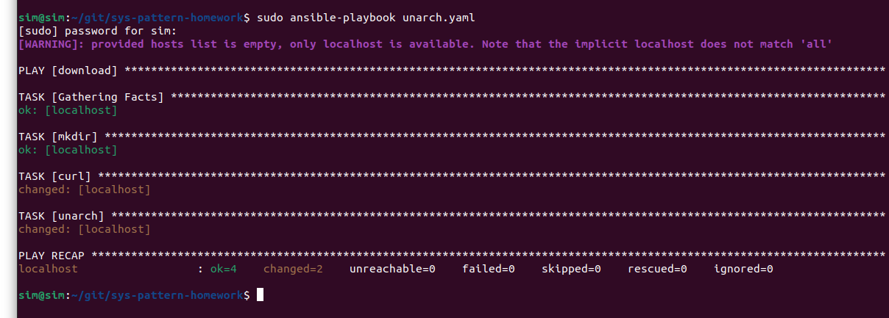
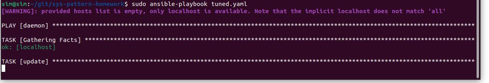

## Ansible 2 - Savchenko Serafima

# Task 1





---

# Task 2

```
---
- name: remote_motd
  hosts: all
  become: yes

  tasks:
    - name: custmo_motd
      ansible.builtin.copy:
        content: |
          ==========================================
          Хостнейм : {{ ansible_hostname }}
          IP-адрес : {{ ansible_default_ipv4.address | default('Не определен') }}
          Хорошего дня!
          ==========================================
        dest: /etc/motd
        mode: '0644'
        owner: root
        group: root

    - name: block_default_motd
      ansible.builtin.file:
        path: "/etc/update-motd.d/{{ item }}"
        state: absent
      loop:
        - "10-help-text"
        - "50-motd-news"
        - "90-updates-available"
        - "91-release-upgrade"
        - "95-hwe-eol"
        - "98-reboot-required"
      ignore_errors: yes

```

---

# Task 3

playbook.yaml 
```
---
- name: Apache
  hosts: all
  become: yes
  roles:
    - apache_webserver

```

roles/apache_webserver/handlers/main.yaml 

```
---
- name: Restart Apache
  ansible.builtin.service:
    name: apache2
    state: restarted
```

roles/apache_webserver/templates/custom_apache.conf.j2 
```
ServerTokens Prod
ServerSignature Off
Timeout 60
```

roles/apache_webserver/templates/idnex.html.j2 
```
<!DOCTYPE html>
<html lang="ru">
<head>
    <meta charset="UTF-8">
    <meta name="viewport" content="width=device-width, initial-scale=1.0">
    <title>Системная информация сервера</title>
    <style>
        body { font-family: 'Segoe UI', Tahoma, Geneva, Verdana, sans-serif; margin: 40px; background-color: #f4f4f9; }
        h1 { color: #333; }
        table { border-collapse: collapse; width: 60%; background-color: #fff; box-shadow: 0 2px 5px rgba(0,0,0,0.1); }
        th, td { border: 1px solid #ddd; padding: 12px; text-align: left; }
        th { background-color: #007BFF; color: white; }
        tr:nth-child(even) { background-color: #f9f9f9; }
    </style>
</head>
<body>
    <h1>Характеристики сервера</h1>
    <table>
        <tr>
            <th>Параметр</th>
            <th>Значение</th>
        </tr>
        <tr>
            <td>IP-адрес</td>
            <td>{{ ansible_default_ipv4.address }}</td>
        </tr>
        <tr>
            <td>Процессор (CPU)</td>
            <td>{{ ansible_processor_count }} физический(их), {{ ansible_processor_cores }} ядро(ер) на каждый</td>
        </tr>
        <tr>
            <td>Оперативная память (RAM)</td>
            <td>{{ (ansible_memtotal_mb / 1024) | round(2) }} ГБ</td>
        </tr>
        <tr>
            <td>Объем HDD (раздел /)</td>
            <td>
                
                {{ (root_mount.size_total / 1073741824) | round(2) if root_mount else 'Не определено' }} ГБ
            </td>
        </tr>
    </table>
</body>
</html>
```

roles/apache_webserver/tasks/main.yaml 
```
---
- name: install
  ansible.builtin.apt:
    name: apache2
    state: present
    update_cache: yes

- name: config
  ansible.builtin.template:
    src: custom_apache.conf.j2
    dest: /etc/apache2/conf-available/ansible-managed.conf
  notify: Restart Apache

- name: manage apache
  ansible.builtin.file:
    src: /etc/apache2/conf-available/ansible-managed.conf
    dest: /etc/apache2/conf-enabled/ansible-managed.conf
    state: link
  notify: Restart Apache

- name: index
  ansible.builtin.template:
    src: index.html.j2
    dest: /var/www/html/index.html

- name: enable apache
  ansible.builtin.service:
    name: apache2
    state: started
    enabled: yes

- name: open port
  ansible.builtin.iptables:
    chain: INPUT
    protocol: tcp
    destination_port: '80'
    jump: ACCEPT
    state: present

- name: check
  ansible.builtin.uri:
    url: "http://{{ ansible_default_ipv4.address }}/"
    status_code: 200
  register: web_check
  changed_when: false

- name: result
  ansible.builtin.debug:
    msg: "Веб-сайт доступен! HTTP статус: {{ web_check.status }}"
```
